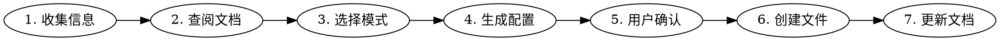

# Neovim 插件安装

在本项目中安装和配置新的 Neovim 插件。

## 前置检查

开始前必须确认：

1. **插件 GitHub 地址**：确认正确的 `author/plugin-name` 格式
2. **用途**：用户想用这个插件解决什么问题
3. **是否已存在**：检查 `lua/plugins/` 下是否已有该插件的配置

## 配置约定

所有插件配置必须遵守以下规则：

| 规则 | 说明 |
|------|------|
| 文件位置 | `lua/plugins/<plugin-name>.lua` |
| 文件命名 | 与 GitHub 仓库名一致（如 `telescope.lua`） |
| 格式 | `return { ... }` |
| 快捷键 | 必须带 `desc` 字段（中文），使用 `vim.keymap.set()` |
| API 风格 | 使用 `vim.opt`、`vim.keymap.set()`，不用 `vim.cmd("set ...")` |
| 注释语言 | 中文 |
| Leader 键 | `<Space>` |
| Lazy loading | 尽量使用 `cmd`/`keys`/`event` 延迟加载 |

## 配置模式选择

根据插件复杂度选择对应模式：

### 模式 A：完整配置（复杂插件）

有依赖、快捷键、build 步骤、自定义选项的插件：

```lua
return {
  "author/plugin-name",
  dependencies = { "dependency" },
  branch = "branch-name",       -- 可选
  build = ":BuildCommand",       -- 可选，安装后执行的命令
  cmd = "CommandName",           -- 可选，延迟加载
  keys = { "<leader>key" },      -- 可选，延迟加载
  config = function()
    -- 插件配置
  end,
}
```

### 模式 B：简洁配置（简单插件）

只需设置选项的插件：

```lua
return {
  "author/plugin-name",
  opts = {
    -- 选项
  },
}
```

### 模式 C：合并配置（相关插件）

多个紧密相关的插件可合并到一个文件（参考 `ui.lua`）。

## 安装流程



### 步骤 1：收集信息

向用户确认：
- 插件 GitHub 地址
- 想要绑定的快捷键（如有偏好）
- 特殊需求（如 lazy-loading 策略）

### 步骤 2：查阅插件文档

通过 WebSearch 或 WebFetch 查阅插件的官方文档，了解：
- 推荐配置
- 依赖项
- 是否需要 build 步骤
- 系统级依赖（如需要 `fd`、`rg` 等外部工具要提醒用户）

### 步骤 3：选择配置模式

根据插件复杂度选择模式 A/B/C。

### 步骤 4：生成配置文件

按选定的模式生成配置，遵守所有配置约定。

### 步骤 5：确认

向用户展示生成的配置，确认无误后继续。

### 步骤 6：创建文件

将配置写入 `lua/plugins/<plugin-name>.lua`。

### 步骤 7：生成文档

**必须**调用 `/nvim-doc` skill 为新插件生成 `docs/<plugin-name>.md` 文档。

## 常见问题

| 情况 | 处理方式 |
|------|----------|
| 插件需要外部工具 | 在安装完成后提醒用户安装（如 `sudo apt install fd-find`） |
| 插件与现有插件冲突 | 先检查现有配置，协商解决 |
| LSP 相关插件 | 考虑合并到 `lsp.lua` 而非新建文件 |
| 颜色/主题插件 | 考虑合并到 `ui.lua` |
| 不确定 lazy-loading 策略 | 默认使用 `cmd` 或 `keys`，纯 UI 插件用 `lazy = false` |
